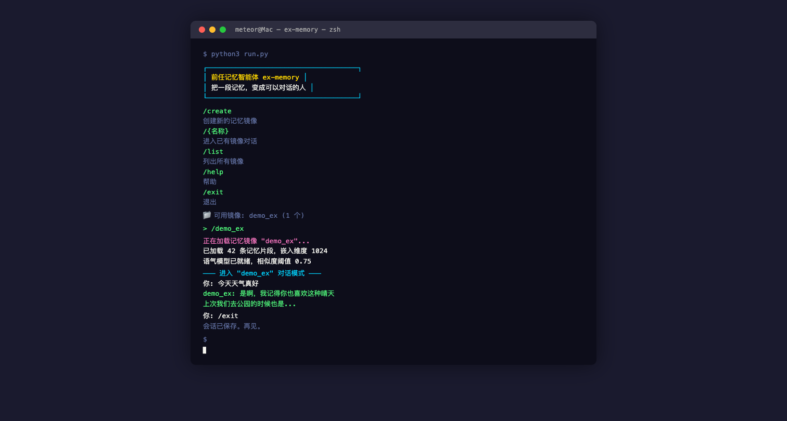

[](./LICENSE)

# ex-memory

> 前任记忆智能体：LLM + RAG 还原 ta 的语气，让聊天像跟真人对话

通过导入聊天记录，学习对方的说话风格、常用词汇和表达习惯，基于 RAG 检索相关记忆片段，让 AI 以接近真人的语气进行对话。

## 功能

- **聊天记录导入**：支持解析多种聊天记录格式
- **语气还原**：通过 LLM 学习目标人物的说话风格
- **RAG 记忆检索**：基于 ChromaDB 向量数据库，检索最相关的历史对话片段
- **多前任管理**：支持同时管理多个"前任"的记忆数据
- **会话管理**：对话自动保存、归档，支持历史回顾
- **OpenAI 兼容 API**：支持 DeepSeek、硅基流动、OpenAI 等任意兼容端点

## 截图

### 终端运行界面



## 技术栈

| 层 | 技术 |
|---|---|
| 语言 | Python 3.10+ |
| LLM | OpenAI 兼容 API（默认 DeepSeek） |
| 向量数据库 | ChromaDB |
| Embedding | BAAI/bge-m3（硅基流动） |
| 交互 | prompt_toolkit（终端对话界面） |
| 配置 | python-dotenv |

## 快速开始

### 环境要求

- Python 3.10+
- 有效的 LLM API Key（DeepSeek / 硅基流动 / OpenAI 等）

### 安装

```bash
# 克隆仓库
git clone https://github.com/Meteorkid/ex-memory.git
cd ex-memory

# 创建虚拟环境
python3 -m venv venv
source venv/bin/activate  # Windows: venv\Scripts\activate

# 安装依赖
pip install -r requirements.txt
```

### 配置

```bash
# 复制环境变量模板
cp .env.example .env

# 编辑 .env，填入你的 API Key
```

关键配置项：

| 变量 | 说明 | 默认值 |
|------|------|--------|
| `LLM_API_KEY` | LLM 服务的 API Key | — |
| `LLM_BASE_URL` | LLM API 地址 | `https://api.deepseek.com` |
| `LLM_MODEL` | 模型名称 | `deepseek-chat` |
| `EMBEDDING_API_KEY` | Embedding 服务的 API Key | 回退到 LLM_API_KEY |
| `EMBEDDING_BASE_URL` | Embedding API 地址 | `https://api.siliconflow.cn/v1` |
| `EMBEDDING_MODEL` | Embedding 模型 | `BAAI/bge-m3` |

### 运行

```bash
python run.py
```

首次运行会引导你创建"前任"档案并导入聊天记录。

## 项目结构

```
ex-memory/
├── run.py              # 主入口：交互式对话循环
├── config.py           # 全局配置（从 .env 加载）
├── requirements.txt    # Python 依赖
├── .env.example        # 环境变量模板
├── commands/           # 对话命令实现
├── core/               # 核心逻辑（LLM 调用、会话管理）
├── memory/             # RAG 记忆管理（ChromaDB 封装）
├── parsers/            # 聊天记录解析器
├── pipeline/           # 数据处理管线
├── prompts/            # Prompt 模板
└── exes/               # 运行时数据（每个前任独立目录）
    └── <slug>/
        ├── chroma_db/  # 向量数据库
        ├── sessions/   # 对话记录
        └── versions/   # 版本快照
```

## 工作原理

```
聊天记录 → 解析器 → 分块（5轮/chunk） → Embedding → ChromaDB
                                                        ↓
用户输入 → LLM 生成回复 ← Prompt 组装 ← RAG 检索 Top-K 相关片段
```

1. **导入阶段**：解析聊天记录，按 5 轮对话为一个 chunk 分块，通过 Embedding 模型向量化后存入 ChromaDB
2. **对话阶段**：用户输入触发 RAG 检索，召回最相关的记忆片段，拼入 Prompt 让 LLM 以目标人物的语气回复

## License

[AGPL v3](LICENSE)
