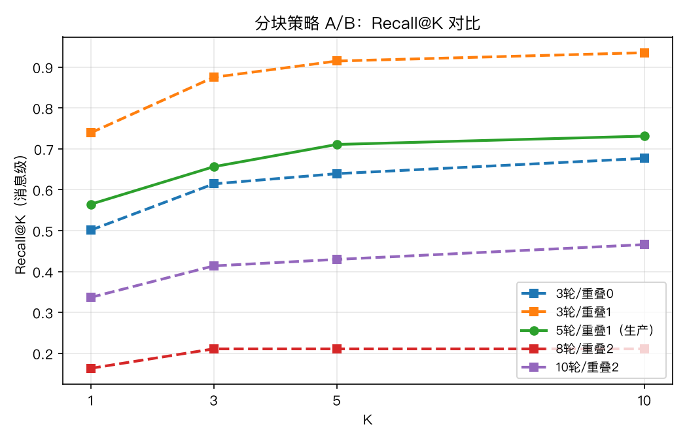
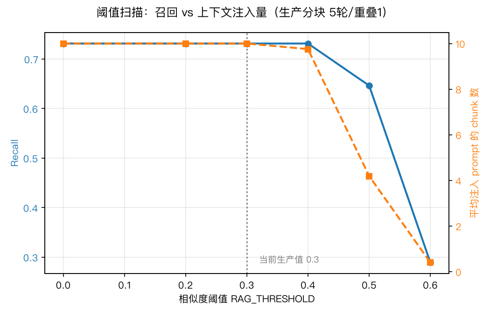
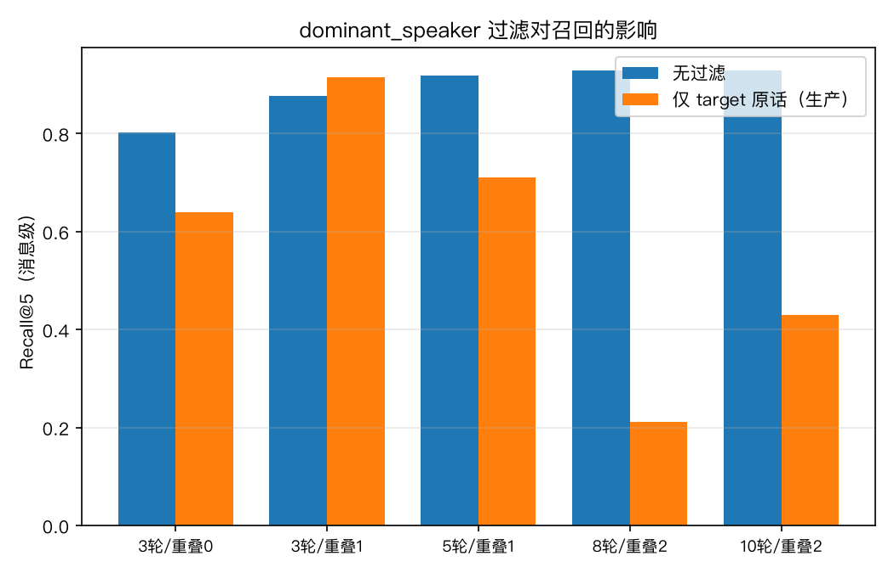
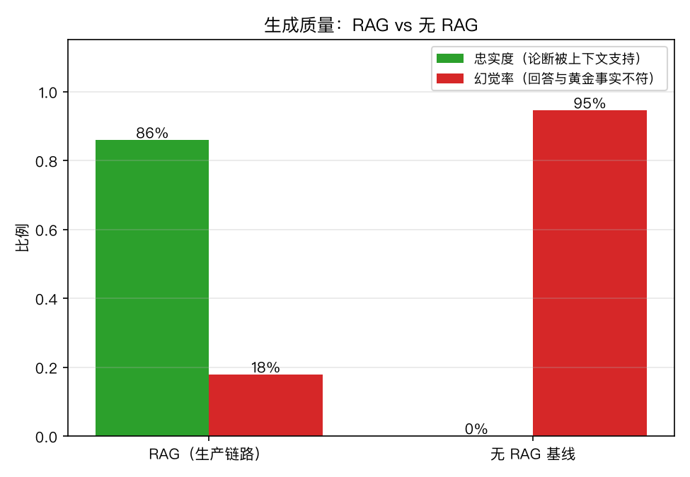

# RAG 评测报告

> 生成日期：2026-07-19　|　语料：316 条消息　|　Golden Dataset：147 条查询　|　Embedding：BAAI/bge-m3

评测方法：合成微信风格语料 + 消息级 ground truth（chunk ID 随分块参数变化，
消息级标注才能横向对比分块策略）。指标全部手写实现，见 `evals/metrics.py`。
复现：`python -m evals.run_eval all`

## 1. 分块策略 A/B（生产检索路径）

| 配置 | chunks | Recall@5 | Recall@10 | MRR | nDCG@10 | Precision@5 |
|---|---|---|---|---|---|---|
| 3轮/重叠0 | 106 | 63.9% | 67.7% | 0.623 | 0.654 | 14.6% |
| 3轮/重叠1 | 158 | 91.5% | 93.5% | 0.826 | 0.821 | 22.0% |
| 5轮/重叠1（生产） | 79 | 71.1% | 73.1% | 0.655 | 0.638 | 23.3% |
| 8轮/重叠2 | 53 | 21.1% | 21.1% | 0.190 | 0.199 | 4.9% |
| 10轮/重叠2 | 40 | 43.0% | 46.6% | 0.394 | 0.410 | 12.1% |

最优配置：**3轮/重叠1**（Recall@5 91.5%，生产配置为 71.1%）。

## 2. 相似度阈值扫描（RAG_THRESHOLD）

| 阈值 | Recall | 平均注入条数 | 注入命中率 |
|---|---|---|---|
| 0.0 | 73.1% | 10.0 | 12.7% |
| 0.2 | 73.1% | 10.0 | 12.7% |
| 0.3 | 73.1% | 10.0 | 12.7% |
| 0.4 | 73.1% | 9.8 | 13.8% |
| 0.5 | 64.6% | 4.2 | 34.4% |
| 0.6 | 28.9% | 0.4 | 30.9% |

## 3. dominant_speaker 过滤的代价

生产路径只检索 `dominant_speaker == target` 的 chunk。
对比无过滤检索，量化该过滤对召回的影响：

## 4. 生成质量：忠实度与幻觉率

抽样 60 条查询（每个事实簇最多一条），生成模型 deepseek-chat（生产采样参数），judge 模型 deepseek-chat（temperature=0，论断级判定）。

| 模式 | 忠实度 | 幻觉率 | 论断准确率 | 计分回答数 |
|---|---|---|---|---|
| RAG（生产链路） | 85.9% | 17.9% | 79.6% | 56 |
| 无 RAG 基线 | — | 94.5% | 12.2% | 55 |

- 忠实度 = 回答中被检索上下文支持的论断占比（无 RAG 基线没有上下文，不适用）
- 幻觉率 = 含「与黄金事实矛盾/凭空编造细节」论断的回答占比（严格口径）
- judge 解析失败剔除 0 条，不参与计分

## 5. 失败案例（生产配置下 Recall@10 最低）

| qid | 类别 | Recall@10 | 首个命中排名 | 库中相关 chunks |
|---|---|---|---|---|
| coffee-q1 | 偏好 | 0.0% | 未命中 | 0 |
| coffee-q2 | 偏好 | 0.0% | 未命中 | 0 |
| coffee-q3 | 偏好 | 0.0% | 未命中 | 0 |
| color-q1 | 偏好 | 0.0% | 未命中 | 0 |
| color-q2 | 偏好 | 0.0% | 未命中 | 0 |

逐条明细见 `evals/results/retrieval_results.json` 的 `per_query_prod`。

## 局限性

- 语料为合成数据（真实聊天记录涉及隐私，不进仓库）；同一套 harness 可直接对私有语料复跑。
- judge 与生成模型同源（DeepSeek），存在同源偏置；可通过环境变量 `EVAL_JUDGE_MODEL` 换用第三方 judge 交叉验证。
- 生成采样温度取生产值，非 0，忠实度/幻觉率存在轮次间波动。
